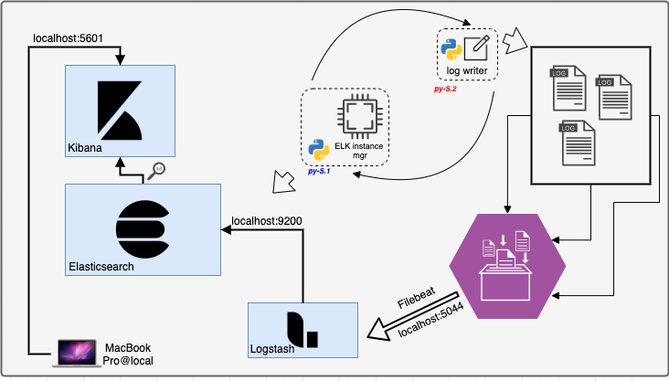
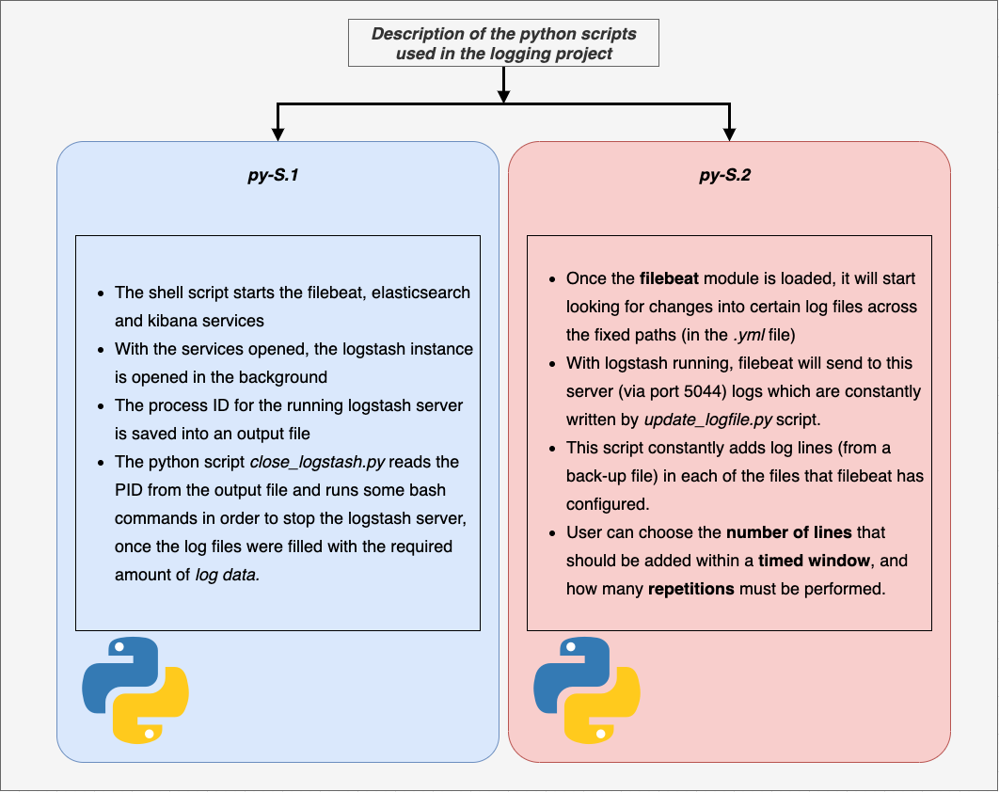
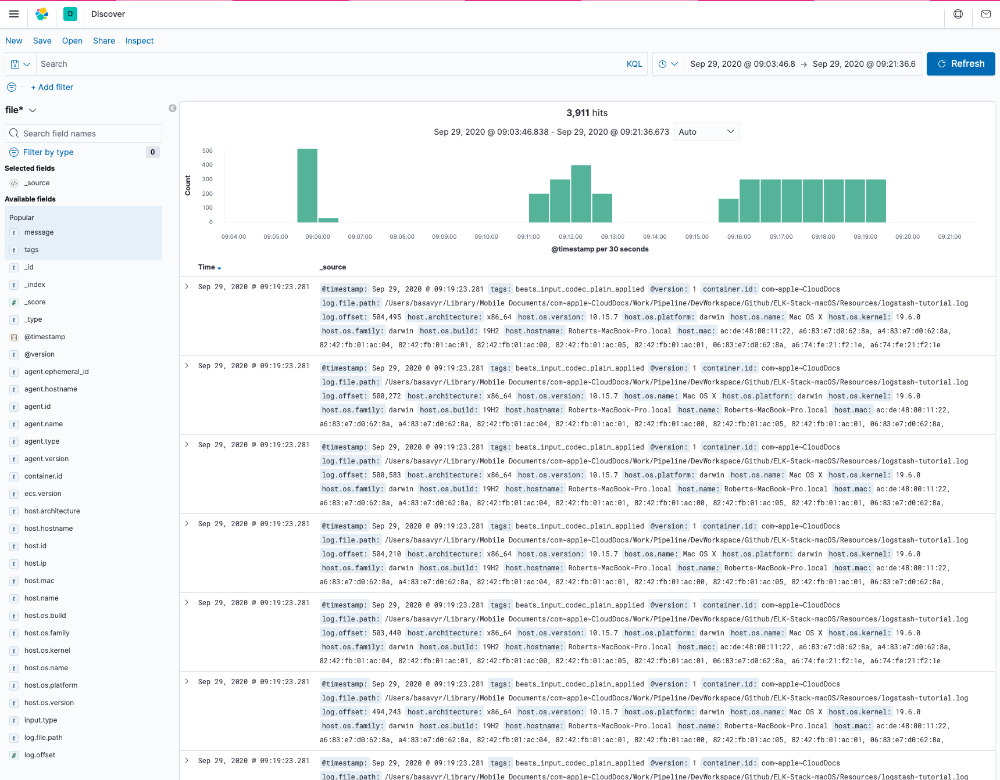

# ELK Stack on macOS

## Configuration and overall management of an ELK stack running on a MacBook Pro

This project aims at running a working [ELK](https://www.elastic.co/) stack fully customizable and configurable by the user. The entire service is configured on macOS Catalina, on a 16'' MacBookPro.

System metrics will be collected to a **logstash** server, and the parsed data will be sent to the elasticsearch server.

Using Kibana UI, one can see the entire index pattern and create any queries on the collected data.

## ELK stack


<!--  -->

> *"ELK" is the acronym for three open source projects: Elasticsearch, Logstash, and Kibana. Elasticsearch is a search and analytics engine. Logstash is a server‑side data processing pipeline that ingests data from multiple sources simultaneously, transforms it, and then sends it to a "stash" like Elasticsearch. Kibana lets users visualize data with charts and graphs in Elasticsearch.*

## Running environment

Elasticsearch will be installed on a MacBook Pro running macOS Catalina.
Configuration of the machine:


System info:

```bash
uname-a
Darwin Roberts-MacBook-Pro.local 19.6.0 Darwin Kernel Version 19.6.0: Mon Aug 31 22:12:52 PDT 2020; root:xnu-6153.141.2~1/RELEASE_X86_64 x86_64
```

## ELK information

The versions which are currently running on the machine are as follow:

* Elasticsearch: v 7.9.2

```json
{
  "name" : "Roberts-MacBook-Pro.local",
  "version" : {
    "number" : "7.9.2",
    "build_flavor" : "default",
    "lucene_version" : "8.6.2",
    "minimum_wire_compatibility_version" : "6.8.0",
    "minimum_index_compatibility_version" : "6.0.0-beta1"
  },
  "tagline" : "You Know, for Search"
}
```

* Kibana: v 7.9.2
* Logstash: 7.9.2
* Metricbeat: 7.9.2
* Filebeat: 7.9.2

> Release date for `7.9.2`: September 24, 2020.

## Workflow

**Main goal**: View the MacBook Pro's system metrics in realtime with Kibana. Data will be stored in a Elasticsearch index.

___
> ***General information, configuration setup issues and solutions will be described in detail [here](Resources/description.md).***
___

## Deploying a logging pipeline with filebeat & logstash using python

The metricbeat pipeline has the default configuration, which sends system metrics to the logstash server, and then further sent to in index belonging to the ES instance running locally.

However, with filebeat, any log files can be sent to Elasticsearch to be explored with Kibana. This is a second goal of the current project, namely:

[ ] - Configuring a filebeat module to send logs from a certain file to Elasticsearch, and explore the content with Kibana.

[Filebeat](https://www.elastic.co/beats/filebeat) is used to get logs from a certain location (details below), and then send them to logstash. The local machine has a logstash service installed, and it is able to output the ingested logs to ES. Filebeat module is configured in such a way that the log file existent in the current project tree (see this [file](Resources/logstash-tutorial.log)) is sent to logstash.

***filebeat inputs:***

```yml
# ============================== Filebeat inputs ===============================
filebeat.inputs:
- type: log
  enabled: true
  paths:
    - "/Users/basavyr/Library/Mobile Documents/com~apple~CloudDocs/Work/Pipeline/DevWorkspace/Github/ELK-Stack-macOS/Resources/logstash-tutorial.log"
```

***filebeat config:***

```yml
output.logstash:
  # The Logstash hosts
  hosts: ["elk.nipne.ro:5044"]
```

### Delivering logs constantly

Because this is a static file and it is not tied to any active monitoring tool or service, there should be a process which constantly adds more log lines into the file, so that logstash would have a continuous data stream to send to ES.
A solution is to use `python`  to read the initial log file, then just randomly select some log lines which will be added constantly, within a timed window, so that one can easily visualize the data stream.

The overall process can be automated with the help of a straightforward shell script which takes care of the following steps:

1. make sure every service required for log shipping, storing and visualizing are working (i.e. elasticsearch, filebeat, and kibana services are started).
2. start a logstash instance which listens to `beats` coming on port `5044` and configured to output into a specific ES index.
3. start writing log-lines into the fixed log-file (at a pre-configured path), so that filebeat can deliver the new content to logstash.
4. stop logstash after the desired amount of data has been shipped.

Example of some content from the file:

```log
218.30.103.62 - - [04/Jan/2015:05:29:06 +0000] "GET /blog/geekery/puppet-facts-into-mcollective.html HTTP/1.1" 200 9872 "-" "Sogou web spider/4.0(+http://www.sogou.com/docs/help/webmasters.htm#07)"
198.46.149.143 - - [04/Jan/2015:05:29:13 +0000] "GET /blog/geekery/solving-good-or-bad-problems.html?utm_source=feedburner&utm_medium=feed&utm_campaign=Feed%3A+semicomplete%2Fmain+%28semicomplete.com+-+Jordan+Sissel%29 HTTP/1.1" 200 10756 "-" "Tiny Tiny RSS/1.11 (http://tt-rss.org/)"
```

Python was used in the workflow for the following tasks:

* Writing log-lines into the file, at specific time intervals. The number of lines and time interval can be fully customized by the user. (The implementation also cleans the file if the size becomes too large for a proper management).
* Run shell commands so that the logstash server can be stopped when the required logs finish *shipping*.

### Detailed workflow with the filebeat-logstash-es-kibana implementation



The two mentioned scripts inside the diagram (namely S1 and S2) are described as follows:




### Kibana & UI



### Development of a parallel procedure for writing log-lines into log files

This is realized with the help of some python3 implementations described also [in this file](Resources/description.md).

Diagrams, code snippets and explanations are given for each step of the overall project.

## Adding tags and unique identifiers for each log file 

Following the progress of being able to send logs into different resources files *(multiple files)*, another feature is also extended for the ELK stack workflow, namely: 

> The filebeat configuration pipeline is adding unique tags for each of the log files

In addition to having identifiable log files, logstash server is also extended with the following feature:

> logstash is now capable of creating multiple indices for elasticsearch, so that one can visualize the logs in separate instances within kibana.

Setup for logstash pipeline:

```yml
# Sample Logstash configuration for creating a simple
# Beats -> Logstash -> Elasticsearch pipeline.

input {
  beats {
    port => 5044
  }
}

output {
  elasticsearch {
    hosts => ["http://localhost:9200"]
    manage_template => false
    index => "%{[fields][log_type]}-index"
  }
}
```