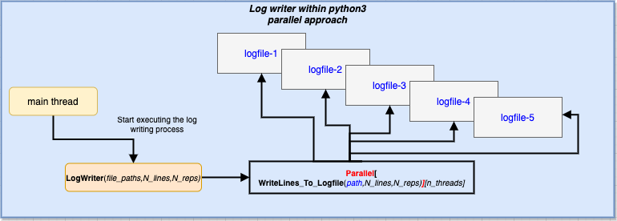

# Configuration description

Store any relevant configuration information, issues and solutions, as well as relevant sources that help at maintaining a solid stack running.

## Paths for every service

Install dirs: mostly in `/Cellar/` (since these services are installed via the **homebrew package**).

More info [here](https://www.elastic.co/guide/en/elasticsearch/reference/current/brew.html).

Conf dirs: 

```bash
/usr/local/etc
```

### Elasticsearch

Install path (with `/bin`, readme and so on):

```bash
/usr/local/Cellar/elasticsearch-full/7.9.2
```

Configuration file path ([`elasticsearch.yml`](../Conf/elasticsearch.yml)):

```bash
/usr/local/etc/elasticsearch
```

### Kibana

Install path (with `/bin`, readme and so on):

```bash
/usr/local/Cellar/kibana-full/7.9.2
```

Configuration file path ([`kibana.yml`](../Conf/kibana.yml)):

```bash
/usr/local/etc/kibana
```

### Logstash

Install path (with `/bin`, readme and so on):

```bash
/usr/local/Cellar/logstash-full/7.9.2
```

Configuration file path ([`logstash.yml`](../Conf/logstash.yml)):

```bash
/usr/local/etc/logstash
```

### Metricbeat

Install path (with `/bin`, readme and so on):

```bash
/usr/local/Cellar/metricbeat-full/7.9.2
```

Configuration file path ([`metricbeat.yml`](../Conf/logstash.yml)):

```bash
/usr/local/etc/metricbeat
```

## Running a test for sending metrics

Using metricbeat, it is possible to ingest logs into a logstash instance via the following configuration pipeline (managed within logstash).
With this simple pipeline, logstash can listen to any beats via the standard port, and then send the results (so far unparsed) to the elasticsearch server via the standard `9200` port.

```yml
# Sample Logstash configuration for creating a simple
# Beats -> Logstash -> Elasticsearch pipeline.

input {
  beats {
    port => 5044
  }
}

output {
  elasticsearch {
    hosts => ["http://localhost:9200"]
    index => "%{[@metadata][beat]}-%{[@metadata][version]}-%{+YYYY.MM.dd}"
    #user => "elastic"
    #password => "changeme"
  }
}
```

Running the pipeline can be done directly from a logstash executable, pointing to the default configuration as an argument.

```bash
bin/logstash -f /usr/local/etc/logstash/logstash-sample.conf
```

Output can be then seen within Kibana (see example [here](kibanaElastic.pdf)).

## Filebeat example

By configuring **Filebeat** to send a certain log (given a path), logstash ingests that particular lor, and then outputs it to elasticsearch server.

Check the filebeat config [here](../Conf/filebeat.yml)

The pipeline allows logstash to ingest a log file (the actual file is [this one](logstash-tutorial.log)) and send it through elasticsearch. With Kibana, it is possible to see the content of the file.

[The Kibana UI with filebeat input](filebeatKibana.pdf).

## Check the existent indices on the elasticsearch server

With the following query (done directly in the browser), while ES instance is running, one can see all the indices created on the server.

```html
http://localhost:9200/_cat/indices
```

Results for this ES instance are as follows:

```text
green  open .kibana-event-log-7.9.2-000001 fKi45-HOS5m5ajsN1yZpWA 1 0     1   0   5.5kb   5.5kb
green  open .apm-custom-link               YZAuMTEwQ2iz5oyn9npSOA 1 0     0   0    208b    208b
green  open .kibana_task_manager_1         wM8uCqDbSvGGShveCDBlwQ 1 0     6 867 297.8kb 297.8kb
green  open .kibana-event-log-7.9.1-000001 VSPVEjXmQe2efe-A6VPsdA 1 0     1   0   5.5kb   5.5kb
green  open .apm-agent-configuration       1EOMdRuWReOxbbEdErC1CQ 1 0     0   0    208b    208b
green  open .async-search                  DSEMH06FR6iGjZehiB6C2Q 1 0     0   0    12mb    12mb
green  open .kibana_2                      mGhpsWZWQPCRQVrLDQoHfg 1 0    47  96  10.4mb  10.4mb
green  open .kibana_1                      7DDvtXHoRMOpABWn0Oe56g 1 0    27  43  10.6mb  10.6mb
yellow open metricbeat-7.9.2-2020.09.27    YCef8YYGTP2aFyyyKAlFBQ 1 1  3742   0   2.9mb   2.9mb
yellow open filebeat-7.9.2-2020.09.27      YvVWNMQyQDm9xHmopgR_kQ 1 1 71851   0  31.6mb  31.6mb
```

> More info on doing ES queries [here](https://www.elastic.co/guide/en/elasticsearch/reference/6.8/cat-indices.html).

## Issues encountered in the development stages

1. [exceptioncaught-event-was-fired](https://discuss.elastic.co/t/logstash-an-exceptioncaught-event-was-fired-and-it-reached-at-the-tail-of-the-pipeline-it-usually-means-the-last-handler-in-the-pipeline-did-not-handle-the-exception/180515)
2. [Metricbeat Failed to connect EOF](https://discuss.elastic.co/t/metricbeat-failed-to-connect-eof/210939)

## Taking the advantage of multi-threaded approach in writing logs

The python implementation which is constantly writing log lines into a file has been extended to support multiple file writing (within [this commit](https://github.com/basavyr/ELK-Stack-macOS/commit/a4935221926952092da02aa382c1adda2b63842c)).
Moreover, the batch of log files in which this script shoudl write log lines was already determined. Within a timed window, a certain number of log lines will be added into each file.

This process can be realized in a serial manner (as it was firstly implemented) but also one can take advantage of the multi-threaded nature of the machine (more precisely, 16 threads).

```python
print(multiprocessing.cpu_count())
```

It is possible to **parallelize** a process in python using `joblib` package. A straightforward approach can bee seen below:

```python
from joblib import Parallel
from joblib import delayed

import multiprocessing

values = ['files-1', 'files-2', 'files-3', 'files-4', 'files-5']

parallel_process = Parallel(n_jobs=multiprocessing.cpu_count())(
    delayed(long_function)(a, 1, 2, 3, 4, 5) for a in values)
```

The function `long_function` is simultaneously executed by a team of 16 threads. 

>Although it is important to note that it can be possible that the number of tasks that require computation is lower than the available thread pool. In this example, the size of the `values` iterable is 5, and the for loop iterates over the entire array, which means that actually less than 16 threads will be required to complete the job.

The parallel approach must encode every step for writing logs to a file in a single method, which should have the main argument as the path to the file in which each of the available threads will start executing the function.

The overall workflow of the implementation can be seen in the diagram below. It is straightforward to start a writing procedure which takes the file paths as arguments, and within that iterable, every the `Parallel` instance will spawn the required number of threads to write lines into each log file simultaneously.




## Comparison between a serial and a parallel approach in solving an iterated job

It is useful to show a simple example that demonstrates the advantages of adopting a parallel procedure within a task which requires iterated jobs (repeated steps towards obtaining a final result).

In the example below, one uses a list of `filepaths` as the iterable and a method that takes these paths as arguments. The function itself just prints the modified string and the **current thread ID**. Since any job is executed by a python computing pipeline, the essential element that does the calculations is a thread (or *main-thread* in the serial approach). This exact procedure is exemplified in the picture above.

```python
def long_function(a, b, c, d, e, f):
    my_string = str(a)+str(b)+str(c)+str(d)+str(e)+str(f)
    time.sleep(5)
    print(f'⚙️ Thread {threading.current_thread().ident} computed: {my_string}')
```

The long function has multiple arguments, however, the key argument on which the parallelization is based, consists in the file path. That argument can take multiple values, depending on the size of the array which contains all the paths. 

The goal of the procedure is to have a *team of threads* that execute the function in the same time. Since in the actual function scope, there is a thread sleeper (timed for 5 seconds), one expects that the total execution time of the process will be only 5 seconds, (since those 5 paths will be easily executed simultaneously by an available thread pool). And indeed, this is exactly what happens, as one can see in the results of running the following script.

```python
def Threaded(values):
    dash = '-'
    start = time.time()
    # parallel_process
    parallel_process = Parallel(n_jobs=multiprocessing.cpu_count())(
        delayed(long_function)(a, dash, 2, 3, 4, 5) for a in values)
    print(f'⏱ Process took {time.time()-start} s')


def Serial(values):
    dash = '-'
    start = time.time()
    # serial_process
    for a in values:
        long_function(a, dash, 2, 3, 4, 5)
    print(f'⏱ Process took {time.time()-start} s')

```

and with the following output:

```bash
python3 parallels.py
The serial approach:
⚙️ Thread 4477500864 computed: file-1-2345
⚙️ Thread 4477500864 computed: file-2-2345
⚙️ Thread 4477500864 computed: file-3-2345
⚙️ Thread 4477500864 computed: file-4-2345
⚙️ Thread 4477500864 computed: file-5-2345
⏱ Process took 25.00967001914978 s
The parallel approach:
⚙️ Thread 4633124288 computed: file-1-2345
⚙️ Thread 4399766976 computed: file-2-2345
⚙️ Thread 4651130304 computed: file-3-2345
⚙️ Thread 4725927360 computed: file-4-2345
⚙️ Thread 4477668800 computed: file-5-2345
⏱ Process took 5.424691915512085 s
```

***Observation***: This method also shows the thread ID, and it is worth noting that in the serial approach, the thread is the same (main-thread). On the other hand, the parallel approach serves a different ID for each function execution, since there is a different thread which executes the method.

## NOVA-COMPUTE log parsing

The `nova-compute-nodes` generate log files while running live on the servers available at *DFCTI (NIPNE-HH)*.

This logs need to be ingested, parsed and then stored. Main goal is to get a live analysis of all the virtual machines that are configured under a nova compute log, their performance and evolution of relevant parameters (e.g. VCPUs, memory, disk usage).

> More details on the configuration pipeline for logstash instance which aims at parsing the incoming logs can be seen [here](nova-compute-node.md).